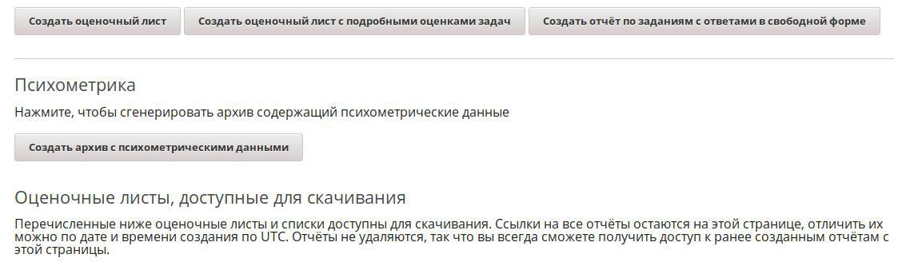
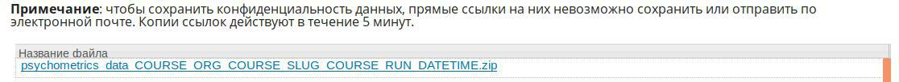

# edx-psychometrics

## Конвертер данных Лекториум

## Установка:

1. Установка пакета `edx-psychometrics`: `sudo /edx/bin/pip.edxapp install git+https://github.com/MasterGowen/edx-psychometrics@master`

2. `/edxapp/edx-platform/lms/envs/common.py`:
В `OPTIONAL_APPS` добавить `'edx_psychometrics',`

3. `/edxapp/lms.env.json`:
во FEATURES добавить
`"ALLOW_PSY_REPORT_DOWNLOADS": true`

4. `/edxapp/edx-platform/lms/envs/aws.py`: 
```
# PSYCHOMETRICS
import imp
try:
    imp.find_module('edx_psychometrics')
    FEATURES["ALLOW_PSY_REPORT_DOWNLOADS"] = FEATURES.get("ALLOW_PSY_REPORT_DOWNLOADS", False)
except ImportError:
    FEATURES["ALLOW_PSY_REPORT_DOWNLOADS"] = False
```

5. `/edxapp/edx-platform/lms/djangoapps/instructor/views/instructor_dashboard.py`:
в фукнкцию `_section_data_download` добавить
```
    if settings.FEATURES.get("ALLOW_PSY_REPORT_DOWNLOADS"):
        section_data['get_psychometrics_data_url'] = reverse('get_psychometrics_data', kwargs={'course_id': unicode(course_key)})
        section_data['get_views_data_url'] = reverse('get_views_data', kwargs={'course_id': unicode(course_key)})
```

6. `/edxapp/edx-platform/lms/djangoapps/instructor/views/api_urls.py`:
```
if settings.FEATURES.get("ALLOW_PSY_REPORT_DOWNLOADS"):
    urlpatterns += patterns("", url(r'get_psychometrics_data', 'edx_psychometrics.api.get_psychometrics_data', name='get_psychometrics_data'))
    urlpatterns += patterns("", url(r'get_views_data',  'edx_psychometrics.api.get_views_data', name='get_views_data'))
```

7. Добавление кнопки загрузки данных в шаблон instructor_dashboard (`/edxapp/edx-platform/lms/templates/instructor/instructor_dashboard_2/data_download.html`):
```
  %if settings.FEATURES.get('ALLOW_PSY_REPORT_DOWNLOADS'):
  <div class="psychometrics">
  <hr>
  <h3 class="hd hd-3">${_("Psychometrics")}</h3>
    <p>${_("Click to generate an archive with psychometrics data.")}</p>
    <p>
      <input type="button" name="get-psychometrics-data" class="async-report-btn" value="${_("Generate psychometrics data")}" data-endpoint="${ section_data['get_psychometrics_data_url'] }"/>
      <input type="button" name="get-views-data" class="async-report-btn" value="${_("Generate views data")}" data-endpoint="${ section_data['get_views_data_url'] }"/>
    </p>
  </div>
  %endif
``` 
8. Перезапуск edxapp и edxapp_worker:
```
/edx/bin/supervisorctl restart edxapp:
/edx/bin/supervisorctl restart edxapp_worker:
```

9. Чудо-строка
```
sudo /edx/bin/pip.edxapp uninstall -y edx-psychometrics; 
sudo /edx/bin/pip.edxapp install git+https://github.com/MasterGowen/edx-psychometrics@master; 
sudo /edx/bin/supervisorctl restart edxapp: edxapp_worker:; 
sudo tail -f /edx/var/log/*/*.log
```

## Использование:

1. Необходимо запустить задачу генерации архива нажатием кнопки "Создать архив с психометрическими данными"("Generate psychometrics data")
Кнопка запуска задачи генерации архива содержащего психометрические данные.


2. После выполнения задачи архив находится в таблице "Оценочные листы, доступные для скачивания" ("Reports Available for Download")

